# 01. Raspberry Pi 환경 구성 및 GPIO 기초

## 학습 목표

Raspberry Pi 5에 Raspberry Pi OS를 설치하고 SSH/VNC 원격 접속 환경을 구성한다.

이후 Linux 기본 명령어와 Python 가상환경을 익히고, GPIO 제어에 필요한 전압·전류·GND·저항·LED의 기초 개념을 학습한 뒤 `gpiozero`를 이용하여 LED를 제어한다.


## 1. Raspberry Pi 개발 환경 구성

### Raspberry Pi와 Raspberry Pi OS

Raspberry Pi는 Linux 기반 운영체제를 실행할 수 있는 소형 싱글 보드 컴퓨터(SBC)이다.  
Raspberry Pi 5에는 Broadcom의 ARM 기반 프로세서가 사용되며, GPIO 핀을 통해 센서·LED·모터 등의 외부 장치를 제어할 수 있다.

Raspberry Pi OS는 Raspberry Pi에서 사용하도록 최적화된 Debian 기반 Linux 배포판이며 Ubuntu와는 별개의 운영체제이다.

### Raspberry Pi Imager로 OS 설치

Raspberry Pi OS 설치에는 Raspberry Pi Imager를 사용하였다.

- 공식 페이지: https://www.raspberrypi.com/software/
- 수업 당시 설치 파일: `imager_2.0.7.exe`

설치 과정은 다음과 같이 진행하였다.

1. Raspberry Pi 모델 선택
2. Raspberry Pi OS 선택
3. MicroSD 카드 선택
4. 필요한 사용자·네트워크 설정
5. MicroSD 카드에 OS 이미지 작성
6. 작성이 끝난 MicroSD 카드를 Raspberry Pi에 장착
7. Raspberry Pi 전원 연결

Raspberry Pi Imager에서 장치와 운영체제를 선택한다.

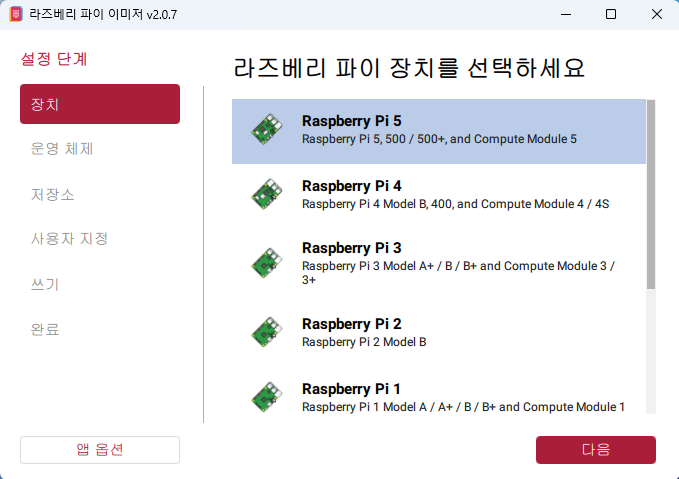

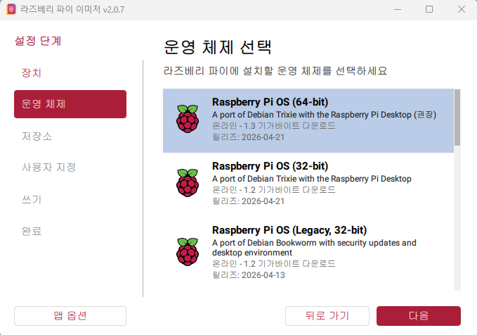

설치할 MicroSD 카드와 사용자·네트워크 설정을 지정한다.

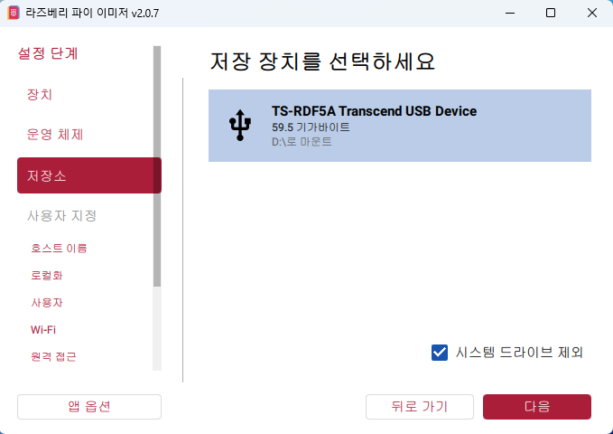

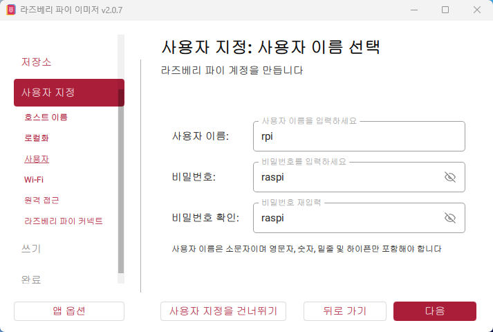

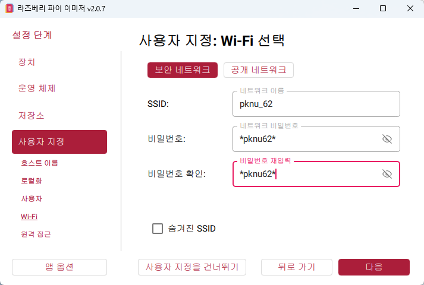

원격 접속을 위해 SSH를 사용할 경우 OS 작성 전에 SSH 기능도 함께 활성화할 수 있다.

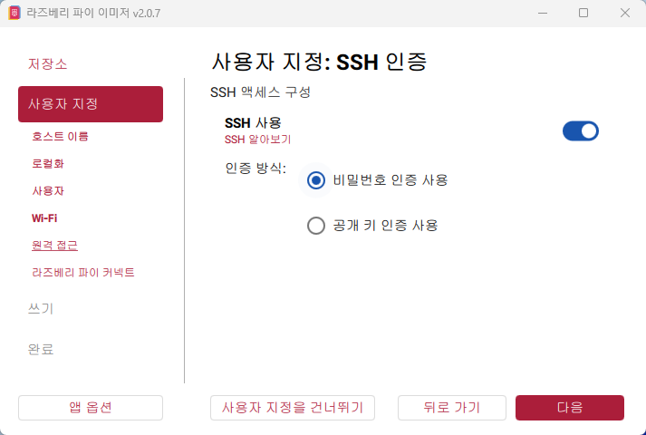

MicroSD 카드는 Raspberry Pi의 주요 저장장치로 사용되므로 OS 설치와 데이터 관리 과정에서 상태와 용량을 함께 확인하는 것이 중요하다.


## 2. 원격 접속 환경 구성

Raspberry Pi를 별도의 모니터 없이 Windows PC에서 사용하기 위해 SSH와 VNC 원격 접속 환경을 구성하였다.

원격 접속을 하려면 먼저 **Raspberry Pi가 현재 네트워크에서 어떤 IP 주소를 사용하고 있는지** 알아야 한다.  
이 IP 주소는 이후 PuTTY, SSH, VNC Viewer에서 Raspberry Pi를 찾을 때 사용한다.

### Raspberry Pi의 IP 주소 확인

Raspberry Pi 터미널에 직접 접근할 수 있다면 다음 명령어로 현재 할당된 IP 주소를 확인할 수 있다.

```bash
hostname -I
```

`hostname -I`는 Raspberry Pi에 할당된 IP 주소를 출력하는 Linux 명령어이다.  
여기서 확인한 주소를 이후 SSH 또는 VNC 접속 주소로 사용한다.

Raspberry Pi 화면에 직접 접근하기 어려운 경우에는 **공유기 관리자 페이지에서 연결된 장치 목록을 확인하는 방법**도 사용할 수 있다.

공유기 관리자 페이지의 주소는 네트워크 환경마다 다르므로 Windows에서 먼저 기본 게이트웨이 주소를 확인한다.

```powershell
ipconfig
```

`ipconfig`는 Windows PC의 네트워크 설정을 확인하는 명령어이다.  
출력 결과에서 `Default Gateway` 또는 `기본 게이트웨이` 항목을 찾는다.

이 값은 일반적으로 현재 PC가 연결된 공유기의 주소이므로 웹 브라우저 주소창에 입력하면 공유기 관리자 페이지에 접속할 수 있다.

```text
Windows에서 ipconfig 실행
        ↓
Default Gateway 확인
        ↓
웹 브라우저에서 해당 주소 접속
        ↓
공유기 관리자 페이지의 연결 장치/DHCP 목록 확인
        ↓
Raspberry Pi에 할당된 IP 주소 확인
```

이렇게 확인한 Raspberry Pi의 IP 주소는 바로 다음 SSH 및 VNC 접속에 사용한다.

### SSH 접속

SSH는 명령어 기반으로 Raspberry Pi에 원격 접속하는 방식이다.

PuTTY를 사용하는 경우 앞에서 확인한 Raspberry Pi IP 주소를 `Host Name`에 입력하고 연결 방식을 SSH로 설정하여 접속한다.

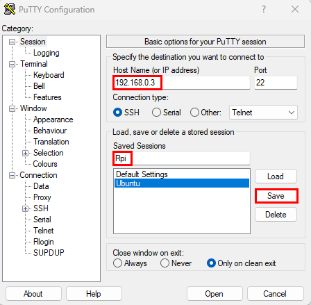

Windows CMD 또는 PowerShell에서는 다음 형식으로 사용할 수 있다.

```bash
ssh <Raspberry-Pi-사용자이름>@<Raspberry-Pi-IP>
```

- `<Raspberry-Pi-사용자이름>`: Raspberry Pi OS 설치 과정에서 설정한 사용자 이름
- `<Raspberry-Pi-IP>`: `hostname -I` 또는 공유기 관리자 페이지에서 확인한 Raspberry Pi의 IP 주소

즉, 앞에서 IP 주소를 확인한 이유는 이 SSH 명령에서 **접속할 Raspberry Pi의 위치를 지정하기 위해서**이다.

SSH 접속 후 패키지 정보를 갱신하고 설치된 패키지를 업데이트하였다.

```bash
sudo apt update
sudo apt upgrade
```

### VNC 접속

GUI 환경이 필요한 경우 RealVNC Viewer를 사용하였다.

- 공식 페이지: https://www.realvnc.com/en/connect/download/viewer/
- 수업 당시 설치 파일: `VNC-Viewer-7.15.1-Windows.exe`

Raspberry Pi에서 다음 설정 도구를 실행하여 VNC 기능을 활성화하였다.

```bash
sudo raspi-config
```

`raspi-config`의 메뉴 번호는 버전에 따라 달라질 수 있으므로 메뉴 이름을 기준으로 확인하는 것이 안전하다.

```text
Interface Options
→ VNC
→ Enable
```

VNC Viewer를 실행한 뒤 앞에서 확인한 Raspberry Pi의 IP 주소를 입력하여 연결한다.

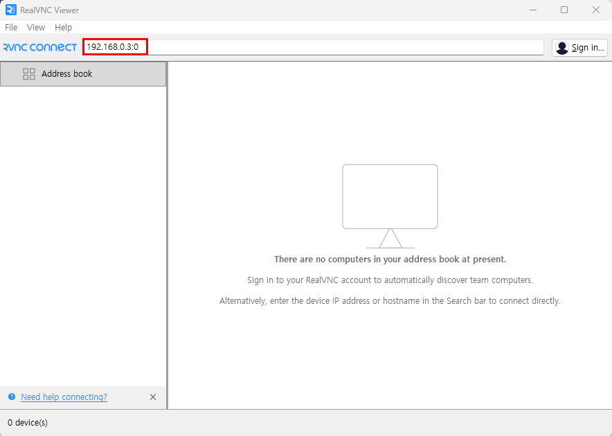

처음 접속할 때 Raspberry Pi의 사용자 이름과 비밀번호를 입력하여 인증한다.

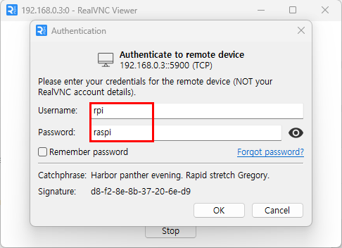

이후 Windows의 VNC Viewer에서 앞서 확인한 Raspberry Pi IP 주소를 접속 주소로 사용한다.

```text
<Raspberry-Pi-IP>
```

환경에 따라 display 번호를 지정해야 하는 경우에는 다음과 같은 형태를 사용할 수 있다.

```text
<Raspberry-Pi-IP>:<display-number>
```

즉 같은 Raspberry Pi IP 주소를 다음과 같이 재사용한다.

```text
Raspberry Pi IP 확인
      ├─ SSH / PuTTY 접속 주소로 사용
      └─ VNC Viewer 접속 주소로 사용
```

GUI가 꼭 필요한 작업이 아니라면 상대적으로 가벼운 SSH를 사용하고, 데스크톱 환경이 필요한 경우 VNC를 사용하는 방식으로 구분하였다.

### 고정 IP

DHCP 환경에서는 Raspberry Pi의 IP 주소가 네트워크 상황에 따라 변경될 수 있다.  
IP가 바뀌면 PuTTY, SSH, VNC에서 사용하던 접속 주소도 다시 확인해야 하므로 원격 접속 주소를 일정하게 유지하기 위해 고정 IP 설정을 실습하였다.

먼저 Raspberry Pi의 네트워크 메뉴에서 연결 설정 화면을 연다.

```text
네트워크 아이콘
→ Advanced Options
→ Edit Connections...
```

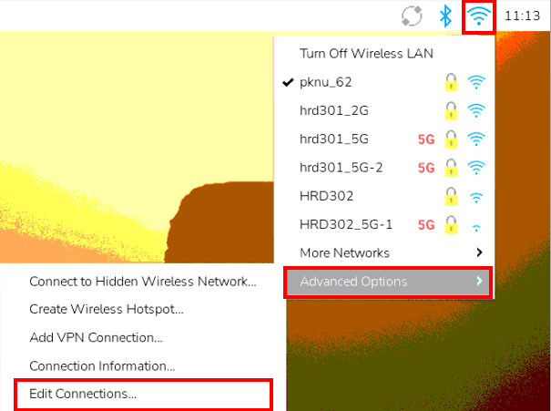

현재 Raspberry Pi가 사용 중인 네트워크 연결을 선택하고 설정 화면을 연다.

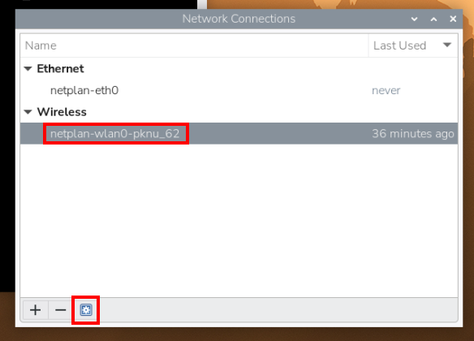

`IPv4 Settings`에서 Method를 `Manual`로 변경한 뒤 현재 네트워크 환경에 맞는 Address, Netmask, Gateway 등의 값을 입력한다.

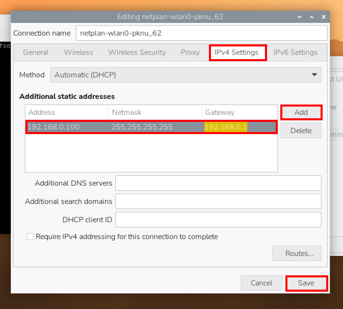

설정에 사용할 네트워크 정보는 임의로 입력하기보다 현재 연결 상태를 확인한 뒤 결정해야 한다.

Raspberry Pi의 현재 IP 주소와 네트워크 인터페이스는 다음 명령어로 확인할 수 있다.

```bash
ip addr
```

기본 게이트웨이는 다음 명령어로 확인한다.

```bash
ip route
```

`ip route` 출력에서 `default via` 뒤에 표시되는 주소가 기본 게이트웨이이다.

서브넷 정보는 `ip addr`의 IP 주소 뒤에 표시되는 CIDR Prefix로 확인할 수 있다.

```text
<IP-address>/24
```

예를 들어 `/24`는 `255.255.255.0` 서브넷 마스크에 해당한다.

메모에 기록되어 있던 `255.255.255.255`는 일반적인 가정용 LAN에서 사용하는 서브넷 마스크로 보기 어렵기 때문에 실제 네트워크 환경의 값을 확인하여 설정해야 한다.

고정 IP는 현재 네트워크에서 이미 다른 장치가 사용 중인 주소와 충돌하지 않도록 선택해야 한다.

설정 후 Raspberry Pi를 재부팅하고, 이후에는 새로 설정한 고정 IP를 PuTTY, SSH, VNC의 접속 주소로 사용한다.


## 3. Linux 환경 및 Python 가상환경

### Linux 기본 명령어

Raspberry Pi OS와 시스템 상태를 확인하면서 다음 명령어를 사용하였다.

| 명령어 | 내용 |
| --- | --- |
| `ls /` | 루트 디렉터리 확인 |
| `cat /etc/os-release` | 운영체제 정보 확인 |
| `lsb_release -a` | Linux 배포판 정보 확인 |
| `uname -a` | 커널 및 시스템 아키텍처 정보 확인 |
| `free -h` | 메모리 사용량 확인 |
| `df -h` | 디스크 사용량 확인 |

`/etc` 디렉터리에는 시스템과 프로그램의 여러 설정 파일이 저장된다.

Nano Editor의 시스템 설정 파일은 다음 명령어로 수정할 수 있다.

```bash
sudo nano /etc/nanorc
```

### 한글 입력 환경 설정

Raspberry Pi OS에서 한글을 표시하고 입력할 수 있도록 한글 폰트와 IBus 기반 한글 입력기를 설치하였다.

먼저 한글 폰트를 설치한다.

```bash
sudo apt install fonts-nanum fonts-nanum-extra
sudo apt install fonts-unfonts-core
```

이후 한글 입력기를 사용하기 위해 IBus와 한글 입력 모듈을 설치한다.

```bash
sudo apt install ibus
sudo apt install ibus-hangul
```

IBus 설정 화면을 실행한다.

```bash
ibus-setup
```

설정 화면에서 다음 순서로 한글 입력 방식을 추가한다.

```text
Input Method
→ Add
→ Korean 검색
→ Korean - Hangul 선택
→ Add
```

한글 입력 전환 키를 설정하려면 `Korean - Hangul` 항목의 `Preferences`로 들어가 Key 설정에서 원하는 전환 키를 등록한다.

설정 후 필요하면 IBus를 다시 시작한다.

```bash
ibus restart
```

Raspberry Pi를 안전하게 종료할 때는 다음 명령어를 사용하였다.

```bash
sudo shutdown now
```

### Python 가상환경

GPIO 제어에 필요한 패키지를 설치하였다.

```bash
sudo apt install python3-libgpiod
sudo apt install python3-gpiozero python3-lgpio
```

시스템에 설치된 Python 패키지를 가상환경에서도 사용할 수 있도록 `--system-site-packages` 옵션을 사용하였다.

```bash
python -m venv --system-site-packages .venv
```

가상환경 활성화:

```bash
source ./.venv/bin/activate
```

가상환경 종료:

```bash
deactivate
```


## 4. GPIO 제어를 위한 전기 기초

### GPIO와 GND

GPIO는 **General Purpose Input/Output**의 약자로 Raspberry Pi에서 외부 장치의 입력과 출력을 처리하는 범용 핀이다.

핀 배치는 다음 명령어로 확인하였다.

```bash
pinout
```

GPIO 회로를 구성할 때는 GPIO 번호뿐 아니라 Raspberry Pi의 `3.3V`, `5V`, `GND` 전원 핀을 정확히 구분해야 한다.

GND는 회로에서 전압을 측정하기 위한 기준 전위로 일반적으로 `0V`로 취급한다.

### 전압과 전류

전압은 두 지점 사이의 전위차이며, 전류는 전하의 흐름을 나타낸다.

회로 이론에서는 전류의 방향을 양전하가 이동한다고 가정하여 다음과 같이 정의한다.

```text
관습적 전류 방향: + → -
전자 이동 방향:   - → +
```

금속에서 실제로 이동하는 전자는 음전하를 가지므로 전자의 이동 방향은 관습적인 전류 방향과 반대이다.

### 디지털 신호와 전원 전압

GPIO의 디지털 상태는 논리값으로 표현한다.

```text
LOW  = 논리 0
HIGH = 논리 1
```

다만 `GND = 논리 0`, `전원 전압 = 논리 1`을 완전히 같은 개념으로 보면 안 된다.

`3.3V`·`5V` 전원 핀과 GND는 전원 및 기준 전압에 관한 개념이고, HIGH/LOW는 디지털 신호의 논리 상태이다. Raspberry Pi GPIO는 일반적으로 3.3V 논리를 사용한다.

또한 디지털과 직류(DC)도 같은 개념이 아니다. 디지털은 정보를 이산적인 값으로 표현하는 방식이고, DC는 전압이나 전류의 방향에 관한 전기적 개념이다.

### 저항과 옴의 법칙

저항은 전류의 흐름을 제한한다.

전압, 전류, 저항의 관계는 옴의 법칙으로 표현할 수 있다.

```text
V = I × R
```

수업에서는 옴의 법칙을 이해하기 위한 예제로 3.3V에서 20mA가 흐르는 경우를 단순 계산하였다.

```text
3.3 = 0.02 × R
R = 165Ω
```

여기서 `20mA`는 계산 원리를 설명하기 위한 예시값이며, 실제 Raspberry Pi GPIO에 연결할 때 허용 가능한 전류라는 의미는 아니다. 실제 회로에서는 Raspberry Pi GPIO와 사용하는 LED의 전기적 사양을 확인해야 한다.

또한 실제 LED 회로에서는 LED 자체의 순방향 전압을 고려해야 하므로 다음과 같이 계산하는 것이 더 정확하다.

```text
R = (공급 전압 - LED 순방향 전압) / 원하는 전류
```

### 직렬·병렬 회로

이상적인 직렬 회로에서는 각 부품을 흐르는 전류가 같고, 병렬 회로에서는 각 가지에 걸리는 전압이 같다.

```text
직렬: 전류가 동일
병렬: 전압이 동일
```

가정용 멀티탭도 병렬 연결을 이용하므로 각 콘센트에 동일한 공급 전압이 걸린다. 여러 장치를 동시에 연결하면 전체 소비 전류가 증가하므로 정격 전류와 전력을 초과하지 않도록 주의해야 한다.

회로 해석에는 Kirchhoff 법칙도 사용된다.

- **KCL (Kirchhoff's Current Law)**: 한 노드로 들어오는 전류의 합과 나가는 전류의 합이 같다.
- **KVL (Kirchhoff's Voltage Law)**: 하나의 폐회로를 따라 전압을 모두 더하면 합은 0이 된다.


## 5. LED와 GPIO 출력 제어

### LED와 RGB LED

LED는 **Light Emitting Diode**의 약자로 전류가 흐르면 빛을 내는 다이오드이다.

일반적인 LED는 Anode(+)와 Cathode(-) 단자를 가지며, 새 단색 LED에서는 긴 다리가 Anode, 짧은 다리가 Cathode인 경우가 많다.

RGB LED는 Red, Green, Blue LED가 하나의 패키지에 들어 있으며 공통 단자의 구성에 따라 두 종류로 나뉜다.

#### Common Anode

세 LED의 Anode가 하나로 연결된 방식이다.

```text
Common → VCC
색상 핀 → GPIO
```

회로 구성에 따라 GPIO가 `LOW`일 때 LED가 켜질 수 있다.

#### Common Cathode

세 LED의 Cathode가 하나로 연결된 방식이다.

```text
Common → GND
색상 핀 → GPIO
```

일반적으로 GPIO가 `HIGH`일 때 LED가 켜지는 방식으로 사용할 수 있다.

따라서 프로그램 실행 직후 LED가 예상과 다르게 켜지거나 모든 LED가 켜져 보이는 현상은 RGB LED의 타입, GPIO 초기 상태, 회로의 Pull-up/Pull-down 상태 등에 따라 발생할 수 있다.

### 브레드보드

브레드보드는 납땜 없이 전자 회로를 구성하기 위한 실습용 보드이다.

일반적인 브레드보드는 전원 레일과 중앙 터미널 스트립으로 구성되지만 제품에 따라 내부 연결 구조가 다를 수 있으므로 실제 사용 중인 브레드보드의 연결 구조를 확인해야 한다.

### LED 제어 실습

Python의 `gpiozero` 라이브러리를 사용하여 GPIO에 연결된 LED를 순차적으로 제어하였다.

실습에서는 브레드보드에 LED와 저항을 구성하고 Raspberry Pi GPIO와 연결하였다.

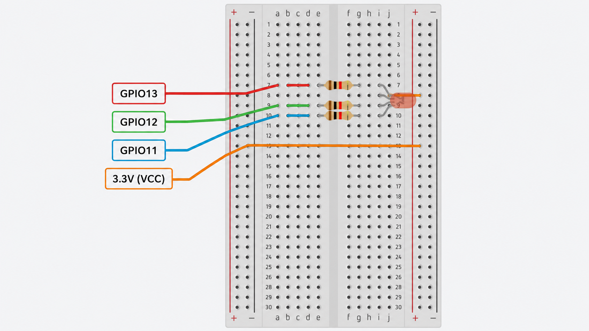

전체 코드는 아래 파일에서 확인할 수 있다.

- [`src/led01.py`](./src/led01.py)

핵심 코드는 다음과 같다.

```python
from gpiozero import LED
from time import sleep

led = [LED(14), LED(15), LED(18)]

while True:
    for i in range(3):
        led[i].on()
        sleep(0.5)
        led[i].off()
```

`led01.py`에서는 GPIO 14, 15, 18에 연결된 3개의 LED 객체를 리스트로 관리하고 반복문을 이용해 하나씩 켠 뒤 0.5초 후 끄도록 구현하였다.

> GPIO 14와 GPIO 15는 UART 기능과 관련된 핀이므로 이후 UART 통신을 사용할 경우 핀 기능 충돌 여부를 확인해야 한다.


## 정리

1일차에는 Raspberry Pi 5를 사용할 수 있도록 Raspberry Pi OS를 설치하고 SSH·VNC 기반 원격 접속 환경을 구성하였다.

이후 Linux 기본 명령어와 Python 가상환경 사용 방법을 익히고, GPIO 제어에 필요한 전압·전류·GND·저항·직렬/병렬 회로·LED의 기본 원리를 학습하였다.

마지막으로 `gpiozero`를 이용하여 실제 GPIO에 연결된 LED를 제어하면서 Raspberry Pi에서 외부 전자 장치를 다루는 기본 흐름을 익혔다.
